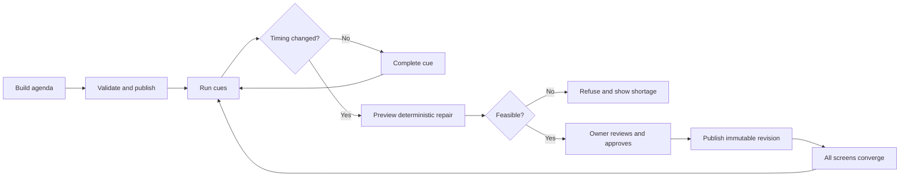
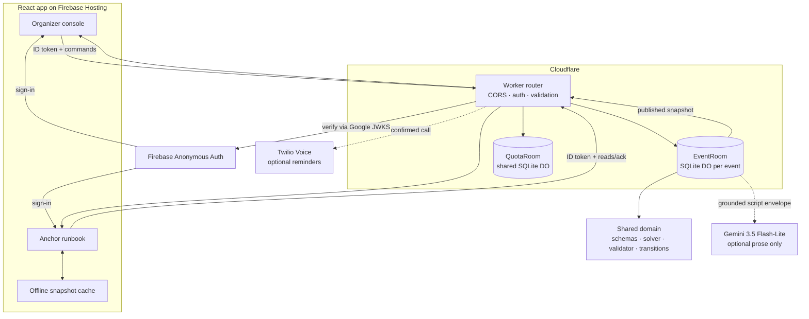
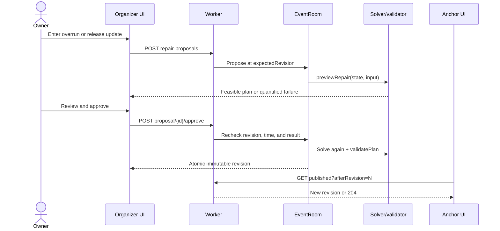
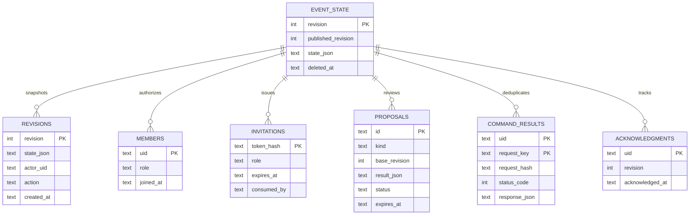

# CuePilot

**Constraint-aware live-event schedule repair that keeps organizers, anchors, and the stage on one approved plan.**

[](https://github.com/yugariwala/Smart-Anchor-Stage-Flow-Management-System/actions/workflows/ci.yml)


[**Live demo**](https://smart-anchor-stage-flow-system.web.app) · [**API health**](https://cuepilot-api-production.cuepilot-api.workers.dev/v1/health) · [**GitHub repository**](https://github.com/yugariwala/Smart-Anchor-Stage-Flow-Management-System)

CuePilot is the completed implementation of the **Smart Anchor / Stage Flow Management System** problem statement. When a segment overruns, it computes a feasible replacement schedule that protects fixed starts and the hard finish, explains every change, and publishes one approved revision to every screen. If no valid plan exists, it refuses to publish and quantifies the shortfall.

## Why CuePilot

Live event teams often coordinate with spreadsheets, chat messages, and verbal updates. Once a cue runs late, those copies disagree: the organizer may have a new plan while the anchor is still reading the old one. Manually compressing the remaining agenda also makes it easy to break a sponsor commitment, a fixed start, or the venue's hard finish.

CuePilot is designed for student clubs, campus event organizers, small production teams, stage managers, anchors, and speakers. The scheduling engine—not an LLM—owns all operational times. Gemini is optional and limited to drafting prose from organizer-approved facts.

## Product tour

The organizer console brings the current cue, countdown, agenda, schedule health, anchor status, and repair controls into one view.

<p align="center">
  
</p>

An overrun produces a reviewable proposal with before/after times, weighted shortening cost, and hard-rule checks. An infeasible proposal cannot be approved.

<p align="center">
  
</p>

| Browser workspace | Event setup |
|---|---|
|  |  |

| Speakers and approved facts | Anchor runbook on mobile |
|---|---|
|  |  |

More workflow captures are available in [`docs/ux-screens-after`](docs/ux-screens-after/).

## How it works

1. **Prepare** — an organizer creates a live or rehearsal event, builds or imports the agenda, defines timing constraints, and adds speakers and approved facts.
2. **Publish** — the Worker validates the draft, computes the initial intervals, and atomically publishes an immutable revision.
3. **Perform** — organizers start and complete cues while anchors follow the read-only mobile runbook and acknowledge revisions.
4. **Repair** — the organizer records an overrun or updated release time. The deterministic solver previews the lowest-cost feasible schedule.
5. **Approve** — only the owner can approve a feasible proposal. The Worker recomputes and validates it before publishing a new revision.
6. **Converge** — visible clients poll the published snapshot and move to the same revision. Cached snapshots become explicitly read-only when offline.



## Key features

| Area | Delivered capability |
|---|---|
| Schedule engine | Pure bounded-DP repair solver; fixed cue order; minimum durations; weighted compression; buffers; not-before constraints; fixed starts; hard finish; independent validation |
| Failure handling | Feasible before/after plan or a refusal naming the violated rule, earliest achievable time, limit, and shortage |
| Event setup | Live/rehearsal modes, agenda editor, CSV import, speakers, pronunciation hints, approved facts, and fictional `college-demo-v1` rehearsal |
| Live operations | Current/up-next view, countdown, projected finish, cue start/complete, scenario clock, schedule health, and next-speaker readiness reminder |
| Publication | Immutable revisions, history, expiring proposals, optimistic concurrency, idempotent commands, and anchor acknowledgements |
| Anchor experience | Invitation flow, mobile runbook, behind tracking, announcements, approved scripts, printable A4 runbook, and labelled offline snapshot |
| Host content | English, Hindi, and Gujarati script proposals through Gemini structured output; human approval; deterministic labelled fallback |
| Voice | Read-only browser speech assistant; optional owner-confirmed, one-way Twilio reminder calls |
| Accessibility | Skip link, keyboard paths, focus restoration, live regions, non-colour status, reduced motion, measured contrast, and print verification |
| Retention and quotas | Automatic 72-hour expiry, permanent deletion, one-hour single-use invitations, and event/AI attempt caps |

## Architecture



### Repair and publication boundary



The Worker is the only event-state authority. `apps/web` is mechanically prevented from importing scheduling functions by lint rules. Gemini receives a bounded fact envelope, cannot create timestamps, and has no publish, delete, or network tool.

## Technology stack

| Technology | Purpose |
|---|---|
| React 19 + TypeScript 7 | Typed organizer and anchor interfaces |
| Vite 8 | Development server and production build |
| Radix Themes/Icons + Manrope | UI primitives, icons, and local font assets |
| Firebase Authentication + Hosting | Anonymous identities and static SPA hosting |
| Cloudflare Workers | Authenticated HTTP API and provider boundary |
| SQLite Durable Objects | Serialized per-event state/revision transactions and quota counters |
| Zod 4 | Strict shared request and state validation |
| `jose` | Firebase ID-token verification against Google JWKS |
| Gemini 3.5 Flash-Lite | Optional structured host-script drafting; never schedule computation |
| Twilio Voice | Optional one-way speaker reminders |
| Vitest + Workers test pool | Domain, web, and real-`workerd` API tests |
| Playwright | Browser rehearsal, accessibility behaviors, and print checks |
| oxlint | Frontend linting and no-solver-import architecture guard |

## Repository structure

```text
.
├── apps/
│   ├── api/                 # Worker, auth, Durable Objects, Gemini/Twilio adapters
│   └── web/                 # React SPA, components, browser tests, and e2e
├── packages/domain/         # Types, Zod schemas, solver, validator, transitions
├── tests/api/               # Worker integration tests in workerd
├── fixtures/                # Fictional rehearsal fixture
├── docs/                    # Decisions, evidence, UX audit, and screenshots
├── firebase.json            # Firebase Hosting configuration
├── vitest.config.ts         # Domain, API, and web test projects
└── package.json             # npm workspace scripts
```

## Getting started

### Prerequisites

- Node.js **24** and npm (the version used by CI)
- a Firebase project with Anonymous Authentication enabled and a web app configured
- a Cloudflare account authenticated through Wrangler for deployment
- Chrome for the Playwright end-to-end suite

Gemini and Twilio are optional. With both flags off, scheduling works and script generation uses the deterministic fallback.

### Install and configure

```bash
git clone https://github.com/yugariwala/Smart-Anchor-Stage-Flow-Management-System.git
cd Smart-Anchor-Stage-Flow-Management-System
npm ci

cp apps/api/.dev.vars.example apps/api/.dev.vars
cp apps/web/.env.example apps/web/.env.local
```

Fill the copied files with your own Firebase values. Both destination files are gitignored. Never copy credentials from another deployment or commit a provider secret.

Start the API and web app in separate terminals:

```bash
npm run dev:api   # http://127.0.0.1:8787
npm run dev:web   # http://localhost:5173
```

### Configuration

#### Web: `apps/web/.env.local`

| Variable | Purpose |
|---|---|
| `VITE_API_BASE_URL` | Worker base URL, including `/v1` |
| `VITE_FIREBASE_API_KEY` | Public Firebase web API key |
| `VITE_FIREBASE_AUTH_DOMAIN` | Firebase Auth domain |
| `VITE_FIREBASE_PROJECT_ID` | Firebase project ID |
| `VITE_FIREBASE_APP_ID` | Firebase web app ID |

Firebase web configuration is public client configuration, not a server credential.

#### Worker: `apps/api/.dev.vars` or Wrangler

| Variable | Required | Default/example | Purpose |
|---|---:|---|---|
| `FIREBASE_PROJECT_ID` | Yes | — | Token issuer/audience validation |
| `ALLOWED_ORIGINS` | Yes | `http://localhost:5173` | Comma-separated CORS allowlist |
| `GEMINI_MODEL` | Yes | `gemini-3.5-flash-lite` | Server-side model selection |
| `AI_ENABLED` | Yes | `false` | Enables Gemini requests |
| `VOICE_REMINDERS_ENABLED` | Yes | `false` | Enables Twilio requests |
| `APP_ENV` | Yes | `dev` | Environment label |
| `BUILD_COMMIT` | Yes | `dev` | Health-response release ID |
| `GEMINI_API_KEY` | For Gemini | secret | Gemini credential |
| `TWILIO_ACCOUNT_SID` | For calls | secret | Twilio account ID |
| `TWILIO_AUTH_TOKEN` | For calls | secret | Twilio credential |
| `TWILIO_FROM_NUMBER` | For calls | secret | Twilio caller number |

Set deployed secrets with Wrangler; never put them in `wrangler.jsonc`:

```bash
npx wrangler secret put GEMINI_API_KEY --env production
npx wrangler secret put TWILIO_ACCOUNT_SID --env production
npx wrangler secret put TWILIO_AUTH_TOKEN --env production
npx wrangler secret put TWILIO_FROM_NUMBER --env production
```

Review provider billing, consent, and quotas before enabling either feature flag. Committed development and production defaults keep both integrations disabled.

## Commands

| Command | Purpose |
|---|---|
| `npm run dev:api` | Start the Worker at `127.0.0.1:8787` |
| `npm run dev:web` | Start Vite at `localhost:5173` |
| `npm run typecheck` | Type-check every workspace |
| `npm run lint` | Run oxlint and enforce the frontend/domain boundary |
| `npm test` | Run domain, API, and web Vitest projects |
| `npm run test:ui` | Run only web Vitest tests |
| `npm run test:e2e` | Run Playwright; starts local servers unless `CUEPILOT_E2E_URL` is set |
| `npm run check` | Run typecheck, lint, and Vitest |
| `npm run build` | Build all applicable workspaces |
| `npm run measure:production` | Run live measurements; creates disposable production events |
| `npm run deploy:api` | Deploy the production Worker |
| `npm run deploy:web` | Build and deploy Firebase Hosting |

> Do not run `npm audit fix --force`. The repository intentionally pins `@cloudflare/vitest-pool-workers`; the forced downgrade is incompatible with Vitest 4. See [`CLAUDE.md`](CLAUDE.md).

## API reference

- Local: `http://127.0.0.1:8787/v1`
- Production: `https://cuepilot-api-production.cuepilot-api.workers.dev/v1`

Except for health, endpoints require `Authorization: Bearer <Firebase ID token>`. State-changing commands use `Idempotency-Key` where the route implements the command ledger, plus `expectedRevision` for revision-sensitive operations. Creation has no prior revision; join and acknowledgement have endpoint-specific semantics.

| Method | Path | Access | Purpose |
|---|---|---|---|
| `GET` | `/health` | Public | Liveness and build commit |
| `PUT` | `/events/{id}` | Creator | Create a draft event |
| `GET` | `/events/{id}` | Owner | Read owner state |
| `PUT` | `/events/{id}/draft` | Owner | Replace the editable draft |
| `POST` | `/events/{id}/publish` | Owner | Validate and publish |
| `GET` | `/events/{id}/published?afterRevision=N` | Owner/anchor | Poll sanitized state; `204` if unchanged |
| `POST` | `/events/{id}/invitations` | Owner | Create a one-use anchor invitation |
| `POST` | `/events/{id}/join` | Invitee | Consume an invitation |
| `POST` | `/events/{id}/ack` | Owner/anchor | Acknowledge a revision |
| `POST` | `/events/{id}/repair-proposals` | Owner | Preview a repair |
| `GET` | `/events/{id}/repair-proposals/{pid}` | Owner | Read a repair proposal |
| `POST` | `/events/{id}/repair-proposals/{pid}/approve` | Owner | Revalidate and publish a repair |
| `POST` | `/events/{id}/script-proposals` | Owner | Generate grounded copy |
| `POST` | `/events/{id}/script-proposals/{pid}/approve` | Owner | Approve edited host copy |
| `POST` | `/events/{id}/announcements` | Owner | Publish an announcement |
| `POST` | `/events/{id}/announcements/{aid}/dismiss` | Owner | Dismiss an announcement |
| `POST` | `/events/{id}/speakers/{sid}/reminder-call` | Owner | Queue a configured reminder call |
| `POST` | `/events/{id}/cues/{cid}/start` | Owner | Start the next cue |
| `POST` | `/events/{id}/cues/{cid}/complete` | Owner | Record cue completion |
| `POST` | `/events/{id}/rehearsal-clock` | Owner | Advance the scenario clock |
| `GET` | `/events/{id}/revisions?before=&limit=` | Owner | Page revision metadata (cap 50) |
| `GET` | `/events/{id}/revisions/{revision}` | Owner | Read a historical revision |
| `DELETE` | `/events/{id}` | Owner | Permanently delete event data |

Requests are limited to 128 KiB. Responses are `no-store`, include `X-Request-Id` and `X-Server-Now`, and use structured error codes.

## Data model and persistence

Schedule minutes are integers relative to `startsAt`; timestamps are UTC ISO-8601. Each event routes to its own SQLite-backed `EventRoom`, so event tables need no `event_id`.



`QuotaRoom` uses a separate `counters` table. See [`apps/api/src/storage/schema.sql`](apps/api/src/storage/schema.sql) and [`packages/domain/src/types.ts`](packages/domain/src/types.ts). State includes phase, revision, current cue, schedule health, agenda constraints/actuals, scripts, announcements, speaker facts, demo provenance, and expiry. Cue actuals carry `actualTimeSource` so rehearsal observations cannot be mistaken for server-clock time.

## Authentication and authorization

- The browser signs in anonymously with Firebase.
- The Worker verifies RS256 signature, issuer, audience, subject, time claims, and key ID through Google's JWKS; there is no Admin SDK or service-account key.
- The creator is `owner` and can mutate, inspect history, invite, and delete.
- A signed-in user becomes `anchor` only through a one-hour, single-use invitation. Anchors can read sanitized published state and acknowledge revisions.
- Non-members receive `404` for event resources to avoid confirming existence.
- Anchor snapshots omit owner-only speaker phone numbers.

## External integrations

| Integration | Data sent | Guardrail |
|---|---|---|
| Firebase Auth | Anonymous identity flow | Token is independently verified server-side |
| Google JWKS | Signing-key lookup | Cached by published headers; unknown key IDs refresh |
| Gemini | Script kind, language, approved facts, bounded context | Disabled by default; structured output; no timestamps/tools; human approval |
| Twilio Voice | Confirmed destination and fixed reminder content | Disabled by default; one-way; no recording; retry-safe reservation |

## Security and privacy

- Event state and immutable revision rows commit in one synchronous, parameterized SQLite transaction.
- Repair approval recomputes and rejects stale, expired, infeasible, time-unreachable, or diverged proposals.
- Invitation secrets have 256 bits of entropy, are stored only as hashes, expire after one hour, and are returned once.
- Idempotency keys bind to a canonical request hash; different content returns `409 IDEMPOTENCY_MISMATCH`.
- Organizer facts cannot use trusted `event:` or `speaker:` prefixes.
- Logs contain sanitized request metadata—not JWTs, invite codes, scripts, biographies, or phone numbers.
- Demo data expires after 72 hours through an alarm and request-entry sweep; owners can delete sooner.
- Offline state is browser-local and displayed as a stale, read-only snapshot.

This is a demonstration system, not audited production infrastructure. Review identity, consent, retention, provider terms, and local calling law before using real personal data.

## Testing and evidence

Vitest runs domain tests on Node, API tests in real `workerd` with real SQLite Durable Objects, and React tests in jsdom.

Current local verification on **2026-09-20**:

| Gate | Result |
|---|---|
| `npm run check` | Passed: typecheck, lint, **362 tests in 24 files** |
| `npm run build` | Passed; Vite emitted the known large-chunk warning below |
| Playwright rehearsal | Last recorded run passed one complete organizer/anchor scenario |

Coverage includes brute-force solver comparison, validation, auth isolation, token failures, atomic publication, idempotency, conflicts, proposal failure modes, quota/expiry behavior, provider fallbacks, localization, offline polling, accessibility interactions, and the end-to-end rehearsal. See [`docs/measurements.md`](docs/measurements.md) for methods and production evidence, and [`docs/feature-inventory.md`](docs/feature-inventory.md) for the source-audited feature matrix.

## Deployment

| Component | Deployment |
|---|---|
| Web | [Firebase Hosting](https://smart-anchor-stage-flow-system.web.app) |
| API | [Cloudflare Worker health](https://cuepilot-api-production.cuepilot-api.workers.dev/v1/health) |
| CI/CD | [`main` workflow](.github/workflows/ci.yml): install, check, build, then web deploy |

The production URLs returned HTTP `200` during the README audit on 2026-09-20. Committed production configuration keeps Gemini and Twilio disabled by default. The Gemini path has recorded real-provider evidence; the Twilio adapter has automated tests but no real-provider validation.

## Troubleshooting

<details><summary><strong>Missing Firebase configuration</strong></summary>

Copy `apps/web/.env.example` to `apps/web/.env.local`, fill all five values, enable Anonymous Authentication, and authorize localhost plus the deployed domain.
</details>

<details><summary><strong>401 UNAUTHENTICATED</strong></summary>

Ensure `FIREBASE_PROJECT_ID` matches the web project and the request has a current Firebase Bearer token. There is no development bypass.
</details>

<details><summary><strong>CORS failure</strong></summary>

Add the exact browser origin to `ALLOWED_ORIGINS`. CORS does not replace authentication or membership checks.
</details>

<details><summary><strong>409 conflict</strong></summary>

Refresh before retrying. Revision, expired/stale proposal, unreachable-time, diverged-result, and infeasible-plan errors intentionally require different recovery actions. Reuse an idempotency key only for an identical retry.
</details>

<details><summary><strong>Gemini returns a template</strong></summary>

This is expected when AI is disabled, unconfigured, unavailable, or fails validation. The output remains reviewable and is labelled `Template fallback — AI unavailable.`
</details>

<details><summary><strong>Playwright cannot start</strong></summary>

Install Chrome, configure both env files, and free ports 8787/5173. To test a deployed target, set `CUEPILOT_E2E_URL` before `npm run test:e2e`.
</details>

## Known limitations

- Hindi and Gujarati text has not been reviewed by qualified native speakers.
- Browser speech support and installed voices vary by browser and OS.
- Twilio calls are disabled by default and not real-provider tested; two-way replies, signed webhooks, detailed consent records, and messaging are absent.
- There is no formal screen-reader audit or accessibility certification.
- One cold/noisy repair-latency repeat missed the target; measurements do not prove globally stable latency.
- The event workspace is browser-local because no server event-list endpoint exists.
- Scheduling is single-stage, fixed-order, and minute-granularity—no parallel tracks, automatic reordering/deletion, or live drag-and-drop.
- The production build warns that one minified JavaScript chunk exceeds 500 kB.
- Anonymous identities are not a substitute for durable organizational accounts and recovery.

## Roadmap

These are ideas, not delivered claims:

| Priority | Candidate enhancement |
|---|---|
| High | Authorized organizer voice commands through the existing server-authoritative flow |
| High | Two-way speaker check-in with consent/status records, signed webhooks, and provider/legal review |
| High | Predictive overrun warnings based on completed-event evidence |
| Medium | Installable PWA, push notifications, and post-event analytics/export |
| Medium | Durable accounts, recovery, co-organizer/stage-manager roles, and complete audit trail |
| Medium | Native-speaker and cross-platform voice review for Hindi and Gujarati |
| Low | Calendar export, QR check-in, and authorized emergency cut-to-next-cue workflow |

## Team

Repository contributors verified from Git history:

- **Yug Ariwala**
- **Heer Jagiwala**

See [GitHub contributors](https://github.com/yugariwala/Smart-Anchor-Stage-Flow-Management-System/graphs/contributors) for repository activity.

## Acknowledgements

Firebase, Cloudflare Workers and Durable Objects, Google Gemini, Twilio, Radix UI, React, Vite, Zod, Vitest, Playwright, `jose`, and the TypeScript ecosystem made this implementation possible.

The rehearsal event and speakers are fictional. No partnership with GDG, a college, or any named organization is claimed.

## License

No license file is present. Unless the maintainers add one, the source is **not licensed for redistribution or reuse by default**. Contact the repository owners for permission.

## Further documentation

- [`PS5-CuePilot-Master-Report.md`](PS5-CuePilot-Master-Report.md) — original specification
- [`CLAUDE.md`](CLAUDE.md) — implementation invariants and dependency warning
- [`docs/decisions.md`](docs/decisions.md) — technical decisions and deviations
- [`docs/demo-script.md`](docs/demo-script.md) — demonstration flow
- [`docs/feature-inventory.md`](docs/feature-inventory.md) — source-audited status
- [`docs/measurements.md`](docs/measurements.md) — test, provider, performance, and accessibility evidence
- [`docs/ux-audit.md`](docs/ux-audit.md) — interface audit and visual verification
