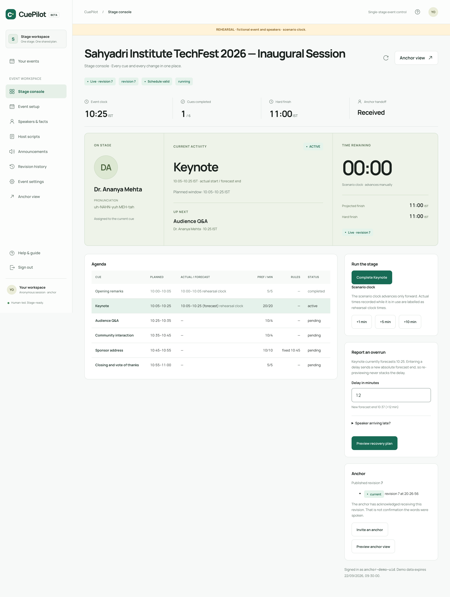
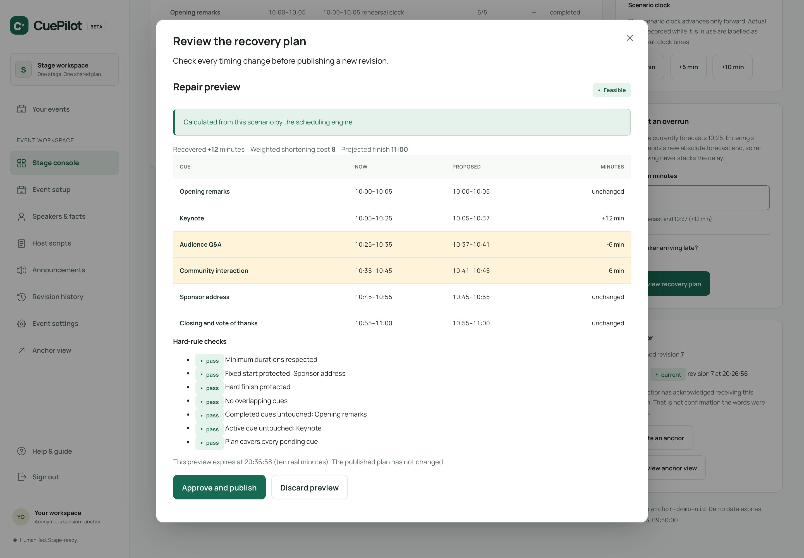
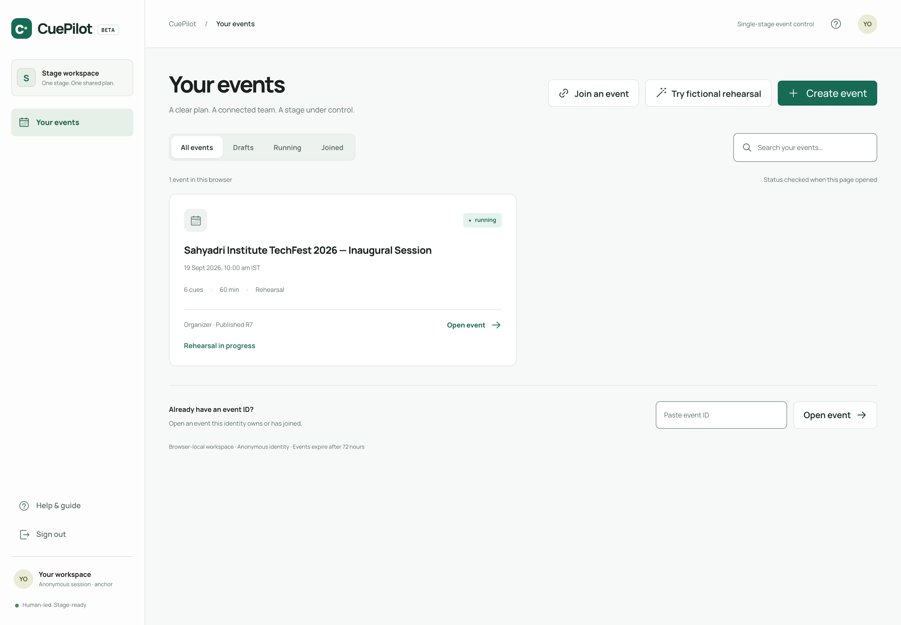
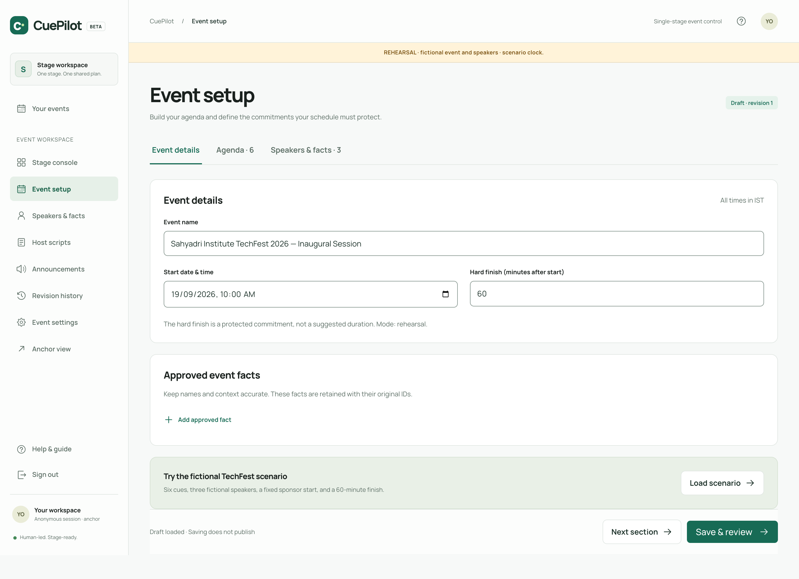
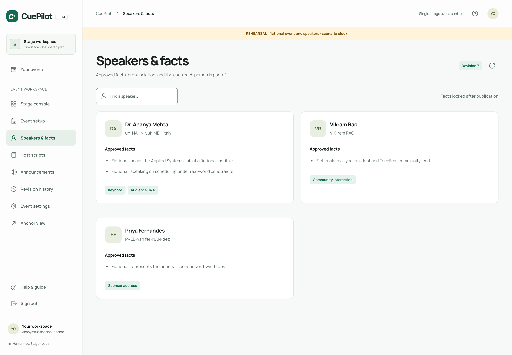
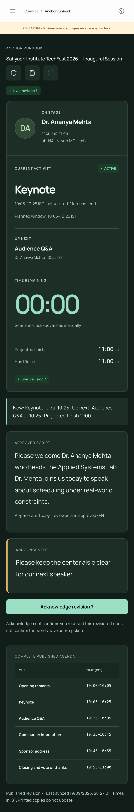

# CuePilot

**Constraint-aware live-event schedule repair.** When a segment overruns, CuePilot calculates a
feasible plan that protects fixed commitments and the hard finish, explains it, and publishes one
approved revision to every screen at once — or refuses, with the shortage quantified.

This repository is the implementation for the *Smart Anchor / Stage Flow Management System*
problem statement.

**Live demo:** https://smart-anchor-stage-flow-system.web.app

**Production API:** https://cuepilot-api-production.cuepilot-api.workers.dev/v1/health

## Screenshots

The organizer console is the centre of the product: current activity, live agenda, the repair
trigger, and anchor status in one view.

<p align="center">
  
</p>

When an overrun is entered, the server returns a before/after plan with the weighted cost and
every hard-rule check — and the shortage quantified when no feasible plan exists.

<p align="center">
  
</p>

| Workspace | Event setup |
|---|---|
|  |  |

| Speakers & facts | Anchor runbook (mobile) |
|---|---|
|  |  |

## What it does

- **Repairs a running schedule.** Given an overrun, `repairSchedule` is a pure, deterministic
  bounded-DP solver that produces a feasible plan (or proves infeasibility and quantifies the
  shortfall) while protecting fixed cues and the hard finish.
- **Keeps the backend authoritative.** All scheduling rules live in `packages/domain`; the
  Cloudflare Worker is the final authority. The frontend only renders what the server published.
- **Publishes one immutable revision at a time.** Organizer and anchor screens converge on the
  same revision number via short-interval polling; every mutation is guarded by
  `expectedRevision` + `Idempotency-Key`.
- **Uses the LLM only for prose.** Gemini drafts scripts and announcements as structured output;
  it never produces timestamps and has no publish/delete/network tool. A deterministic template
  fallback is always available and labelled as such.
- **Records reality, flags the conflict.** A cue completion that violates the plan is still
  recorded, with `scheduleHealth: "needs_repair"`.

## Features and progress

The core product, production deployment, performance sample and browser accessibility checks are
complete. The full interface supports English, Hindi and Gujarati; native-speaker review of the
Hindi and Gujarati translations remains. Next-step enhancements are listed in the
[roadmap](#roadmap--planned-enhancements).

| # | Milestone | Progress |
|---|---|---|
| M0a | Monorepo substrate: npm workspaces, strict TS, Vitest, `packages/domain` skeleton | Complete |
| M0b | `apps/web` scaffold: anonymous sign-in + connectivity probe | Complete |
| M1 | Deterministic repair solver, independent `validatePlan`, fixture, brute-force tests | Complete |
| M2 | Worker router, `EventRoom`/`QuotaRoom` Durable Objects, token verification, full event command set, 72h expiry | Complete |
| M3 | `renderOperationalCue`, repair proposals + approval, cue start/complete, rehearsal clock | Complete |
| M4 | Organizer console, anchor view, setup screen, repair preview | Complete |
| M5 | Gemini script proposals + approval, template fallback, announcements | Complete |
| M6 | Offline snapshot cache, countdown offset, printable runbook | Complete |
| M6 | Accessibility pass (focus management, live regions, keyboard, reduced motion) | Complete |
| M6 | Full UI localisation (English, Hindi and Gujarati) | Complete — translations not native-reviewed |
| Deployment | Firebase Hosting + Cloudflare Worker + production Gemini secret | Complete |

Feature-level status:

| Area | Feature | Status |
|---|---|---|
| Platform | Anonymous auth, server-side ID-token verification (JWKS/RS256) | Complete |
| Platform | Identity-scoped browser workspace, event shortcuts, sign-out | Complete |
| Platform | 72-hour demonstration expiry and permanent deletion | Complete |
| Setup | Create event with start, hard finish and rehearsal/live mode | Complete |
| Setup | Agenda builder: durations, minimums, penalties, buffers, not-before, fixed start | Complete |
| Setup | Speakers, pronunciation hints and approved facts (reserved fact-id prefixes enforced) | Complete |
| Setup | CSV agenda import | Complete |
| Setup | One-click fictional rehearsal (`college-demo-v1`) | Complete |
| Engine | Bounded-DP constraint-aware repair solver + independent validation | Complete |
| Engine | Feasible before/after plan; quantified refusal when infeasible | Complete |
| Backend | Worker router, `EventRoom`/`QuotaRoom` SQLite Durable Objects, daily quota | Complete |
| Backend | Immutable published revisions and revision history | Complete |
| Backend | Idempotency keys and `expectedRevision` conflict handling | Complete |
| Live ops | Cue start/complete, scenario clock, overrun entry and forecast | Complete |
| Live ops | Live stage overview: on stage, current activity, up next, countdown | Complete |
| Live ops | Readiness reminder for the next cue | Complete |
| Live ops | Anchor invitations, join, per-revision acknowledgment and behind tracking | Complete |
| Content | Gemini host-script drafts with mandated labels, human review and approval | Complete |
| Content | Deterministic template fallback when the AI provider is unavailable | Complete |
| Content | Announcements: publish, display and dismiss | Complete |
| Content | Multilingual host copy: English, Hindi, Gujarati | Complete |
| UX | 2s visibility-aware polling with live/amber/stale freshness and backoff | Complete |
| UX | Offline snapshot cache with the labelled stale view | Complete |
| UX | Printable runbook (approved copy + speaker facts) | Complete |
| UX | Accessibility polish (focus traps, live regions, non-colour cues) | Complete |
| UX | Localised interface and page copy (English, Hindi, Gujarati) | Complete — translations not native-reviewed |
| Quality | Domain tests on node, API tests in real `workerd`, Playwright browser e2e | Complete |
| Deployment | Hosted frontend, authenticated Worker, production CORS and real Gemini response | Complete |

## Roadmap — planned enhancements

These are designed but **not yet implemented**. They are ordered by expected impact for a
live-event product and are all compatible with the core rule that the backend — not the LLM —
owns every schedule.

| Enhancement | What it adds | Priority |
|---|---|---|
| **AI voice anchor assistant** | Hands-free control in the browser using on-device speech (Web Speech API). The anchor says "how long is the keynote?" or "start the next cue" and hears deterministic operational times back. Commands still go through the same server-authoritative actions, so the LLM never invents a timestamp. No telephony required. | High |
| **AI speaker reminder / check-in agent** | An automated agent that proactively contacts upcoming speakers (WhatsApp / SMS / email, optional voice call) to confirm they are present and on time, feeding the existing "Speaker arriving late?" path. Overruns get handled *before* they happen, not after. | High |
| **Predictive overrun engine** | Learns per-speaker and per-cue overrun patterns from completed events and warns the organizer before a cue is likely to run long, so a repair can be prepared in advance. | High |
| **Natural-language command bar** | The organizer types or dictates "keynote is running 8 minutes late" and the model maps that to the delay/release command. It only interprets intent; the deterministic solver still computes every timestamp. | High |
| **Push notifications + installable PWA** | A service worker so the runbook is installable, works offline, and pushes approved revisions and announcements to anchors and speakers without an open tab. | Medium |
| **Post-event analytics report** | Actual vs planned per cue, recovered time, repair cost, and an auto-generated event summary — useful evidence for organizers and sponsors. | Medium |
| **Localised voice output** | Spoken Hindi, Gujarati and English output for the already-localised interface and multilingual host copy. | Medium |
| **Role-based collaboration** | Co-organizer and stage-manager roles with their own permissions and a full audit trail, so a large event is not tied to one anonymous browser. | Medium |
| **Calendar export + QR speaker check-in** | ICS export of the approved runbook and a QR check-in for speakers and anchors on arrival. | Low |
| **Emergency "cut to next cue" mode** | One-tap broadcast that skips the current cue, re-plans immediately, and pushes a clearly labelled emergency revision to every screen. | Low |

## Stack

| Layer | Choice |
|---|---|
| Frontend | React + TypeScript + Vite, on Firebase Hosting |
| Styling | Plain CSS / known utility library, Radix Themes |
| Validation | Zod shared schemas in `packages/domain` |
| Backend | Cloudflare Worker, small explicit router |
| Database / concurrency | SQLite-backed Durable Objects (`EventRoom` per event, one shared `QuotaRoom`) |
| Auth | Firebase anonymous auth; ID tokens verified on the Worker via Google public JWKS |
| AI | Gemini 3.5 Flash-Lite via a server-side adapter, structured output |
| Testing | Vitest (domain on node, API in real `workerd`), Playwright for browser e2e |

## Repository layout

```
apps/
  api/      Cloudflare Worker: router, Durable Objects, auth, AI adapter
  web/      React + Vite frontend: organizer console, anchor view, setup
packages/
  domain/   Shared Zod schemas, types, and the deterministic repair solver
tests/
  api/      Worker integration tests (real workerd)
docs/       Decisions log, demo script, measurements, screenshots
fixtures/   Seed scenarios used by tests and the rehearsal
```

`CLAUDE.md` records the non-negotiable invariants, the pinned `@cloudflare/vitest-pool-workers`
version, and the milestone status. `PS5-CuePilot-Master-Report.md` is the authoritative spec.

## Getting started

```bash
npm ci                 # install from the committed lockfile
npm run dev:api        # wrangler dev on http://127.0.0.1:8787
npm run dev:web        # vite on http://localhost:5173
```

`apps/api/.dev.vars` is required for `wrangler dev` and is gitignored. Copy
`apps/api/.dev.vars.example` and fill it in. The web app also needs Firebase web config in
`apps/web/.env.local` (copy `apps/web/.env.example`). `GEMINI_API_KEY` is a Worker secret, set
with `npx wrangler secret put GEMINI_API_KEY`, and must never be committed.

## Commands

```bash
npm run typecheck   # tsc --noEmit in every workspace
npm run lint        # oxlint; enforces that the frontend never computes a schedule
npm test            # vitest run: domain on node, API in real workerd
npm run test:e2e    # Playwright browser suite
npm run check       # typecheck + lint + test
npm run build       # every workspace
npm run deploy:api  # Cloudflare production Worker
npm run deploy:web  # production build + Firebase Hosting
```

> Do **not** run `npm audit fix --force`. It downgrades `@cloudflare/vitest-pool-workers` and
> takes the test suite offline; see `CLAUDE.md` for the full rationale.

## Documentation

- `PS5-CuePilot-Master-Report.md` — authoritative specification
- `CLAUDE.md` — invariants, stack, milestone status, commands
- `docs/decisions.md` — decisions that extend or interpret the spec
- `docs/demo-script.md` — demo recording logistics and beat status
- `docs/measurements.md` — real provider evidence and measurements
